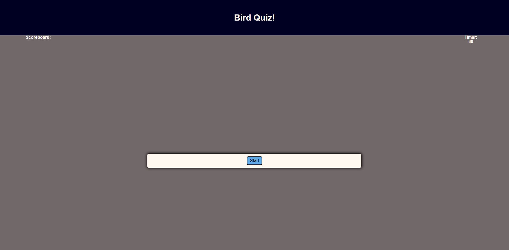

# Pop Quiz App

## Description 

Web app that begins a timer as soon as you select the "Start" button.  Answer as many questions as possible before the timer runs out and enter your name at the end to display under the scoreboard.

Wrong answers will deduct 10 seconds from your time!

https://fainimous.github.io/PopQuiz/

## Sources:

Guide for creating a quiz web app:
https://www.youtube.com/watch?v=riDzcEQbX6k&t=588s

Site for website theme colors:
https://coolors.co/

Questions used in the quiz:
https://www.usefultrivia.com/science_trivia/bird_trivia_index.html

